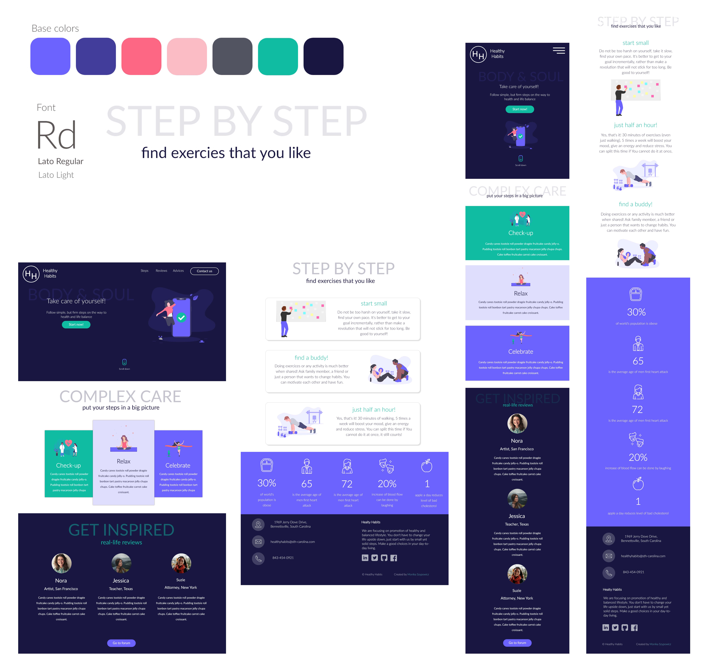

### Healty Habits Website

RWD Project of website promoting balanced lifestyle.

Desinged and prototyped in Adobe XD.

Deployed with Netlify, live version can be seen at:

https://healthy-habits.netlify.com/

#### For developers [Setup instructions];
* You need NPM and GULP installed
* Copy or clone repository
* Cd to project directory and run `gulp`
* Website will be served on: `http://localhost:3000/`

#### Dependencies
* layout made with [Flexbox Layout](https://css-tricks.com/snippets/css/a-guide-to-flexbox/) and [CSS Grid](https://css-tricks.com/snippets/css/complete-guide-grid/)
* icons by [Flaticon Premium](https://www.flaticon.com/)
* illustrations from [unDraw](https://undraw.co/illustrations/)
* automation by [Gulp](https://gulpjs.com/)
* build and deployment by [Netlify](https://www.netlify.com/)